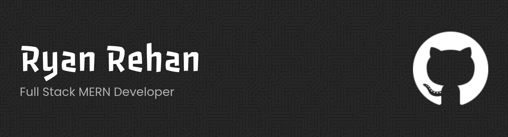

<!-- Banner Image -->

<!-- Name & Designation -->
<h1 align="center">Hi there 👋, I'm Ryan Rehan</h1>
<h3 align="center">MERN Developer | Structured, maintainable, and ready to scale</h3>

---

## About Me

🌱 I’m a full stack MERN developer who loves building clean, scalable, and user-friendly web apps.  
🛠 Skilled in crafting responsive UIs with **React** and **Tailwind CSS**, and building robust backends with **Node.js** and **MongoDB**.  
🔧 Comfortable working with tools like **Firebase**, **Stripe**, **React Hook Form**, **TanStack Query**, and **Git** for smooth development and deployment.  
🚀 Always curious, always learning — whether it’s integrating payments, improving performance, or exploring new tools.  
💡 My goal is simple: write code that’s readable, maintainable, and built to last.

---

## Current Activities

- Building a **Smart Support Management System** featuring AI-powered responses and real-time chat with human agents using **Socket.IO** for seamless communication.  
- Exploring new tools and technologies like **TypeScript** and deepening my understanding of **Socket.IO** for real-time applications.  
- Actively contributing my skills to company projects to gain hands-on experience in team collaboration and development workflows.  
- Currently enjoying debugging — it’s a rewarding challenge that helps me write cleaner, more reliable code.

---

## Languages and Tools

### Frontend

  
  
  
  

### Backend

  
  
  

### Tools & Others

  
  
  
  

---

## Connect with me:

  
  

---

## GitHub Stats

  

